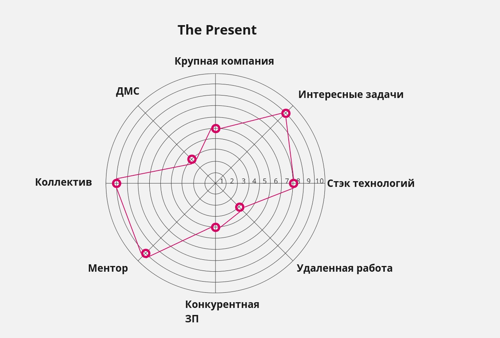
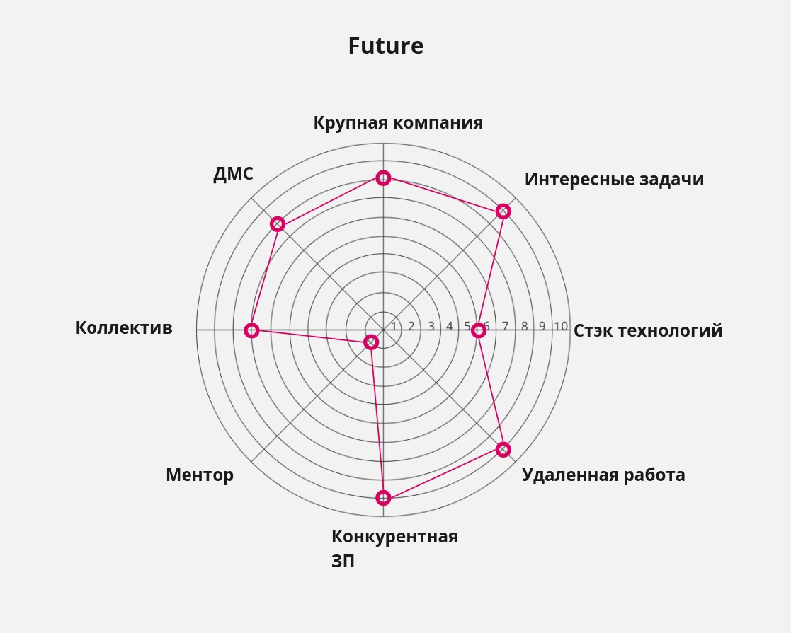

## Career track. Project 00

### Exercise 00

**The wheel of career balance**

Для достижения всех параметров:
1) Изучить стэк который необходим для работы
2) Выполнить несколько pet-проектов в которых буду использовать этот стэк
3) Взять занятия с ментором
4) Откликаться на большое количество вакансий с разными грейдами и ходить на собеседования
5) Записывать вопросы на которые не смог ответить и изучать их глубже

### Exercise 01

