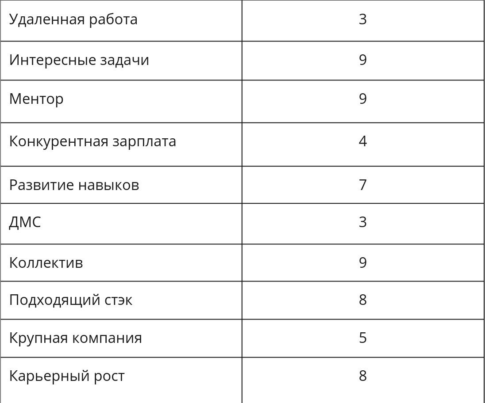
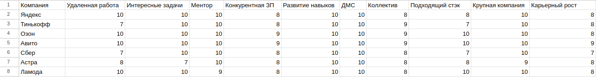
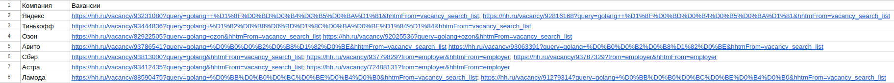
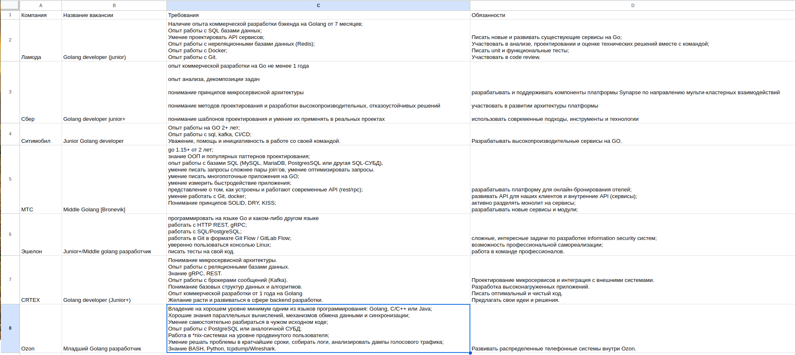
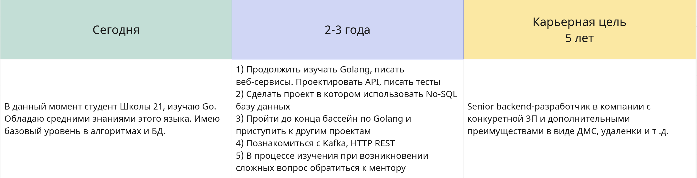
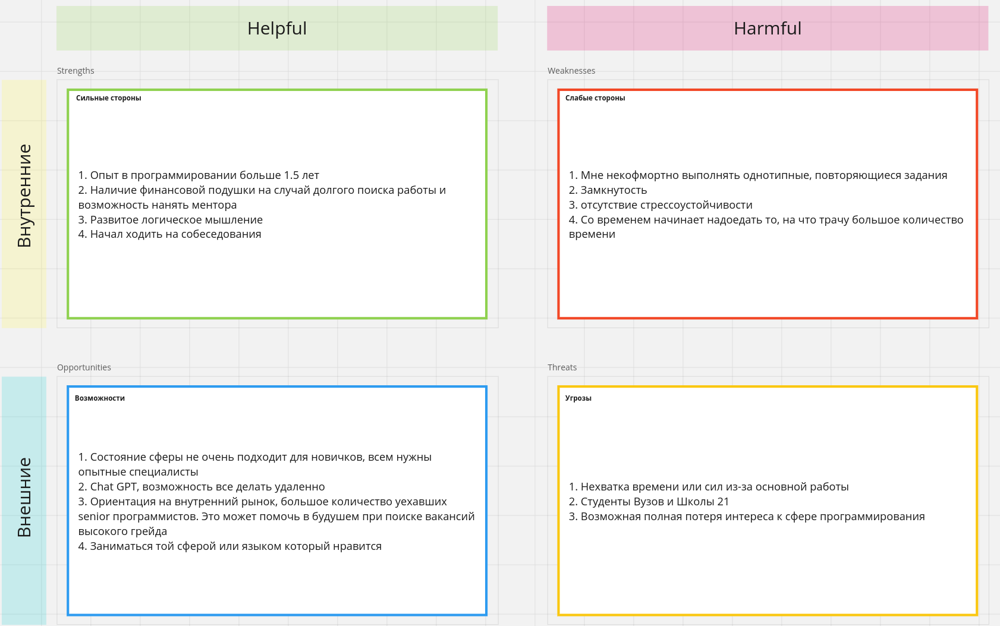

## Exercise 00
* Чек-лист выбора компании

* Cписок компаний где хочется поработать

* Ссылки на вакансии из этих компаний

* Подписаться на карьерные рассылки 1-2 компании

*Подписался на Яндекс и Future today*

## Exercise 01

* 1) **Создать таблицу "Анализ вакансий"**
* 2) **Найти не менее 7 вакансий и занесите их в таблицу.**
* 3) **Проанализировать 7 желаемых вакансий, необходимо выписать все требования и обязанности из вакансий в таблицу.**

* 4) **Исходя из требований и обязанностей, которые выписал — определить, какими владеешь, а какими нет.**

*Владею:*

    Golang, SQL, Docker, Git, CI/CD, ООП, DRY, KISS, Linux

*Есть представление, но не владею в достаточной степени:*

    Умение проектировать API, понимание принципов микросервисной архитектуры, многопоточность, написание тестов на GO

*Не владею:*

    Kafka, No-SQL базы, HTTP REST, gRPC, отсутствует опыт коммерческой разработки

* 5) **Требования и обязанности, которыми ты не владеешь, необходимо понять, как сможешь их достичь. Например, обучение, наставник, опыт на текущем месте, стажировка, фриланс-проект?**

    Kafka, gRPC, HTTP REST выучу самостоятельно, возможно прибегну к помощи ментора.

    Опыт коммерческой разработки буду пытаться получить на стажировке

* 6) **Вернуться в таблицу карьерных целей и на основании аналитики требований и обязанностей, прописать шаги по достижению целей через 2-3 года.**

## Exercise 02

